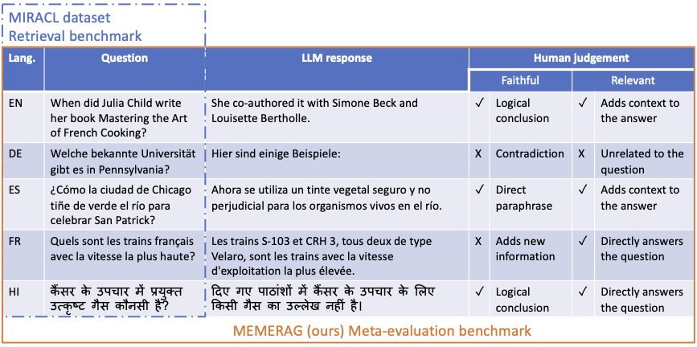

## MEMERAG: A Multilingual End-to-End Meta-Evaluation Benchmark for Retrieval Augmented Generation

Authors: María Andrea Cruz Blandón, Jayasimha Talur, Bruno Charron, Dong Liu, Saab Mansour, Marcello Federico

## Overview
This repository contains [MEMERAG](https://arxiv.org/pdf/2502.17163) dataset. Its intended uses are:
1. Model selection: Evaluate and compare different LLMs for their effectiveness as judges in the "LLM-as-a-judge" setting.
2. Prompt selection: Optimize prompts for LLMs acting as judges in RAG evaluation tasks.

**This is a meta-evaluation benchmark. Data in the benchmark should not be used to train models.**


<p align="center">
    
</p>

## Datasets
We provide three variants of the meta-evaluation datasets:
1. **MEMERAG** (`data/memerag/`): The original dataset
2. **MEMERAG-EXT** (`data/memerag_ext/`): Extended dataset with faithfulness and relevance labels from 5 human annotators
3. **MEMERAG-EXT with Majority Voting** (`data/memerag_ext_w_majority_voting/`): Contains labels obtained through majority voting over 5 annotations.

Each dataset provides RAG meta-evaluation support for English (EN), German (DE), Spanish (ES), French (FR), and Hindi (HI) and is provided in JSONL format with the following structure:

 - query_id: unique identifier for a query. This is same as MIRACL query_id.
 - query: The actual question asked
 - context: Passages used for generating the answer
 - answer: List of dictionaries containing
   - sentence_id: The id of the sentence
   - sentence: A sentence from the answer
   - fine_grained_factuality: Fine grained faithfulness label
   - factuality: Faithfulness label which is one of  `Supported`, `Not Supported` and `Challenging to determine`
   - relevance: Label representing answer relevance
   - comments: Notes by annotators.

## Setup

1. Create a new virtual environment with python 3.10
```shell
conda create -n yourenvname python=3.10
```
2. Install dependencies
```shell
pip install -r requirements.txt
```

## Run the benchmark

The Python script in `src/run_benchmark.py` will run the automated evaluator for a specified prompt and language combination on the MEMERAG dataset.

**Usage**

```
python run_benchmark.py [arguments]
```

**Required Arguments**
```
--lang: Target language for evaluation (choices: 'en', 'es', 'de', 'fr', 'hi')
--dataset_name: The dataset you like to use. Valid values are `memerag` and `memerag_ext_w_majority_vote`
--model_id: LLM model to use (choices: "gpt4o_mini", "llama3_2-90b", "llama3_2-11b", "qwen_2_5-32B")
--sys_prompt_path: Path to system prompt template file. Sample system prompt can be found in the *prompts* directory
--task_prompt_path: Path to task prompt template file. Sample task prompt can be found in the *prompts* directory
```

**Optional Arguments**
```
--temperature: Temperature parameter for LLM (default: 0.1)
--top_p: Top-p sampling parameter (default: 0.1)
--bedrock_region: AWS region for Bedrock models
--aws_profile: AWS profile name
--num_proc: Number of parallel LLM API calls (default: 4)
--num_retries: Number of retry attempts for LLM calls (default: 6)
```

**Supported Evaluator Models**

1. **GPT-4o Mini (`gpt4o_mini`)**
    - Requires setting the `OPENAI_API_KEY` as an environment variable.

2. **Llama 3.2 (11B and 90B) Models**
    - `llama3_2-90b` and `llama3_2-11b` can be used via AWS Bedrock. Please provide appropriate AWS credentials in  `~/.aws/credentials`

3. **Qwen 2.5 32B (`qwen_2_5-32B`)**
    - Can be used via the [VLLM inference server](https://docs.vllm.ai/en/latest/getting_started/quickstart.html).

**Example**

Run `Llama 3.2 90B` as an automatic evaluator with AG + COT prompt.

```shell
cd src

python run_benchmark.py --lang de --dataset_name memerag --model_id llama3_2-90b \
--sys_prompt_path prompts/ag_cot/sys_prompt.md --task_prompt_path prompts/ag_cot/task_prompt.md --num_proc 5
```

The script prints `balanced accuracy` and saves judgments to `llm_judged_dataset.csv` in the specified output directory.

## Citation

If you found the benchmark useful, please consider citing our work.
```{bibtex}
@misc{Cruz2025,
      title={MEMERAG: A Multilingual End-to-End Meta-Evaluation Benchmark for Retrieval Augmented Generation},
      author={María Andrea Cruz Blandón and Jayasimha Talur and Bruno Charron and Dong Liu and Saab Mansour and Marcello Federico},
      year={2025},
      eprint={2502.17163},
      archivePrefix={arXiv},
      primaryClass={cs.CL},
      url={https://arxiv.org/abs/2502.17163},
}
```
